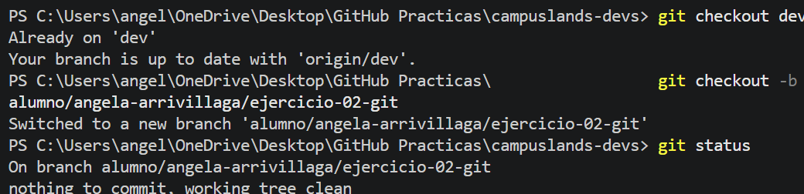
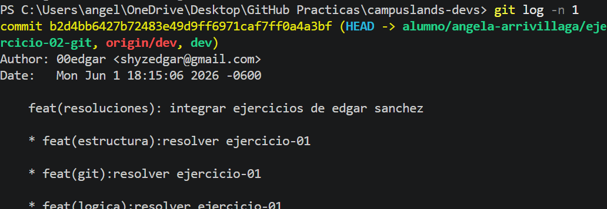

# 🎮 Estructura
Ejercicio 02: Interfaz de ranking para videojuegos MOBA

## 👤 Desarrolladora
**Angela Arrivillaga**
Estudiante en Campuslands - U1

## 📁 Estructura del Proyecto
He diseñado esta arquitectura modular para separar la interfaz de usuario, los estilos y la gestión de datos, permitiendo un flujo de trabajo profesional y escalable:

* **`css/`** 🎨: Contiene las hojas de estilo (`styles.css`) para la presentación visual de la interfaz.
* **`data/`** 📊: Almacena el archivo `players.json` con la información de los jugadores, separando los datos de la lógica.
* **`js/`** ⚙️: Contiene el archivo `app.js` encargado de la lógica de conexión y renderizado de la interfaz.
* **`index.html`** 📄: Punto de entrada principal que conecta los recursos externos.

## 🛠️ Razonamiento Técnico
Para resolver este ejercicio, seguí un enfoque metódico enfocado en la **separación de responsabilidades**:

1.  **Análisis:** Identifiqué que la mejor forma de organizar un frontend es separar la estructura, el diseño y los datos, facilitando así el mantenimiento.
2.  **Ejecución:** Creé una estructura de directorios clara y vinculé los archivos mediante rutas relativas dentro del `index.html`.
3.  **Mantenimiento:** Aseguré la escalabilidad del proyecto, permitiendo que el JSON pueda ser consumido dinámicamente sin necesidad de modificar el HTML.

## ✅ Validación
* ✅ Carpeta personal creada en: `basico/estructura/ejercicio-02/resoluciones/angela-arrivillaga/`
* ✅ Estructura de subcarpetas (`css/`, `js/`, `data/`) cumplida correctamente.
* ✅ Conexión de archivos verificada para un correcto funcionamiento.
* ✅ Nomenclatura en minúsculas aplicada según estándares de desarrollo.

## 📷 Pruebas

### Resolucion de Problemas

Mientras realizaba el ejercicio, cerre el vs code y el GitHub sin cuando ya habia hecho `git add .` pero no realice el commit, por lo tanto, cuando quise continuar con el ejercicio, tuve problemas al realizar el commit, y al momento de hacer el push, el commit me aparecia realizado, sin embargo, no me aparecia en GitHub para realizar un Pull Request.
Entonces, aprendi a utilizar los siguientes comandos:

*   **`git reset --soft HEAD~1`**: Este comando es útil cuando quieres deshacer un commit pero conservar el trabajo realizado en los archivos para corregir algo antes de volver a hacer el commit.
*   **`--force`**: Es necesario cuando reescribes la historia de una rama. Hay que usarlo con precaución, ya que sobrescribirá el historial en GitHub para cualquier otra persona que esté trabajando en esa misma rama.
